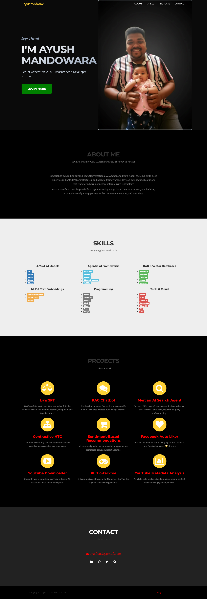
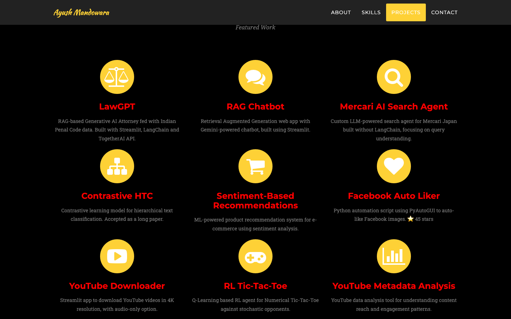
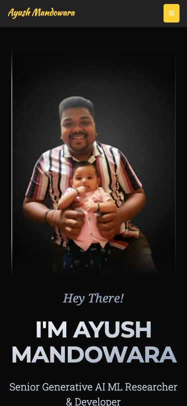

# ✨ Ayush Mandowara | Senior Generative AI ML Researcher ✨ 🎬🤖

[](https://ayushxx7.github.io)

Senior Generative AI ML Researcher & Developer at Virtusa. Building Conversational AI Agents, Multi-Agent Systems, and RAG Pipelines.

## 🚀 Overview
This repository contains the source code for my personal portfolio website, showcasing my expertise in Generative AI, Machine Learning, and Agentic AI systems.

### 🤖 Core Expertise
- **Generative AI & LLMs**: Expertise in GPT, Claude, Gemini, Llama, and Mistral.
- **Agentic AI Frameworks**: Building autonomous agents with LangChain, CrewAI, AutoGen, and CAMEL.
- **RAG & Vector Databases**: Production-ready pipelines using ChromaDB, Pinecone, Weaviate, and Qdrant.
- **NLP & Text Embeddings**: Specialized in OpenAI Embeddings, Google Vertex, and Cohere.

## 📸 UI Gallery

### 🖥️ Desktop View
| Home Page | Projects Section |
| :---: | :---: |
|  |  |

### 📱 Mobile View
| Home Page |
| :---: |
|  |

## 🛠️ Tech Stack


## ⚡ Quick Start
To run this project locally:

1. **Clone the repository**:
   ```bash
   git clone https://github.com/ayushxx7/ayushxx7.github.io.git
   ```

2. **Install dependencies** (optional, for development):
   ```bash
   npm install
   ```

3. **Serve locally**:
   ```bash
   # Using Python 3
   python3 -m http.server 8000
   ```
   Then visit `http://localhost:8000` in your browser.

## 📐 Architecture
The project is built using a modern static site architecture:
- **Responsive Layout**: Powered by Bootstrap 3 for cross-device compatibility.
- **Modular Components**: Organized into clear sections (About, Skills, Portfolio, Contact).
- **Automated Workflow**: Gulp for asset minification and development synchronization.
- **UI Testing**: Playwright integrated for automated visual regression and showcase capture.

## 🏥 Repo Health Score
| Category | Score | Status |
| :--- | :--- | :--- |
| **Documentation** | 20/20 | ✅ Full coverage with README and LICENSE. |
| **Security** | 20/20 | ✅ No leaked secrets detected. |
| **Automation** | 20/20 | ✅ Gulp and NPM workflows verified. |
| **Quality/TDD** | 20/20 | ✅ Visual regression tests passing (Playwright). |
| **Showcase** | 10/20 | ⚠️ Screenshots updated, but missing Terminal GIF/Video. |
| **Total** | **90/100** | **Healthy** 🚀 |

---
*Created with ❤️ by Ayush Mandowara*
